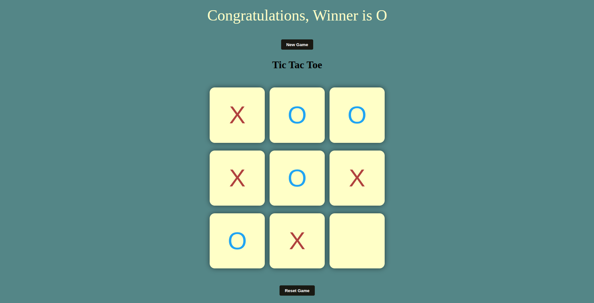

# Tic Tac Toe 🕹️

A simple and fun Tic Tac Toe game built with HTML, CSS, and JavaScript. Play against a friend in the browser!

## 📸 Screenshots


## 🛠️ Technologies Used

- HTML
- CSS
- JavaScript

## 🎮 Features

- Two-player gameplay
- Win/draw detection
- Reset game button
- Simple UI with responsive design

## 📁 Folder Structure

/tic-tac-toe
│
├── index.html
├── style.css
└── script.js

````

## 🧩 How to Run

1. Clone the repo or download the ZIP
2. Open `index.html` in your browser

```bash
git clone https://github.com/Yogesh-Bhagwani/Tic-Tac-Toe.git
cd tic-tac-toe
start index.html   # On Windows
# OR
open index.html    # On macOS